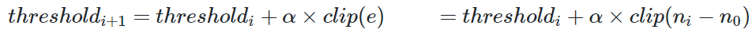
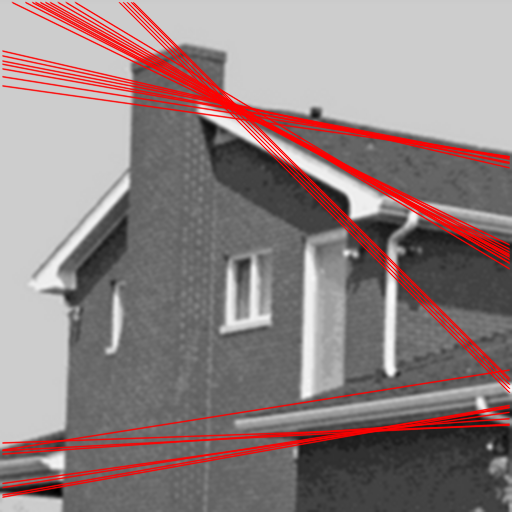
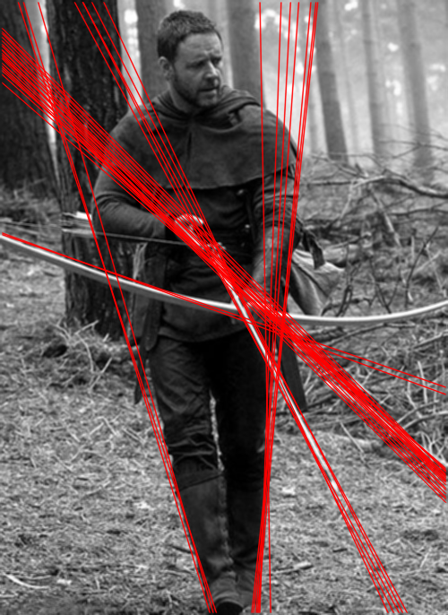
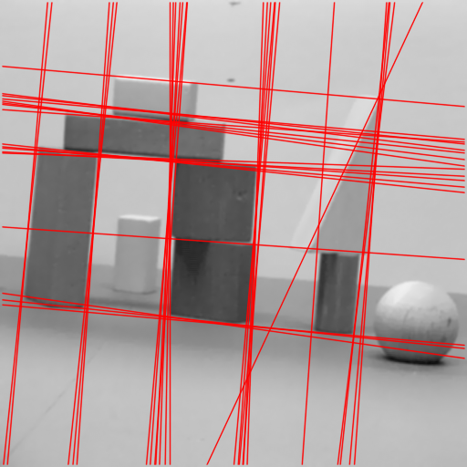
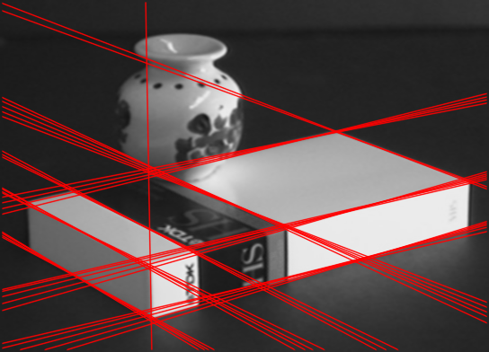

# 直线检测
> No. 2160508170

## 实验内容
- 霍夫变换直线检测
- 自适应阈值霍夫直线检测
- 基于形态学算法优化的直线检测

## 霍夫变换直线检测
- 算法原理

    霍夫变换直线检测算法分为以下三个步骤：
  - 边缘检测

    提取有效边缘线段，过滤无关填充
  - 霍夫直线变换
    
    将图像从欧式空间$(x,y)$转换为直线参数空间$(h,\theta)$
  - 确定显著点
  
    根据阈值在直线参数空间中筛选有效参数点
    

    
    
    
    

- 算法实现
  
  实验使用OpenCV库对算法进行了实现
  - 边缘检测算子：Canny、Sobel、Laplacian以及USP
  - 直线检测：霍夫直线检测、基于采样的霍夫直线检测

- 实验效果
  - 使用Canny边缘检测算子直线检测效果
    - 实验使用固定阈值，阈值由Canny算子对第一张图片检测结果整定
    - 检测到的直线使用红色直线标注
  - 可以看出，Hough直线检测的阈值对图片的类型、边缘检测算子类型有着较强的依赖性。使用Canny算子的前两张图检测质量较好，而其他检测结果均出现了阈值过小的问题
  - 因此为了提高直线检测算法的适应性，一个很直观的解决方式即为将原方法中静态阈值转换为自适应阈值
  

  原图 | Canny | Sobel | USP | Laplacian
   

      

      

      

  

## 自适应阈值霍夫直线检测
  由上一实验我们发现霍夫直线检测中的阈值与图像、检测算子有着较强的相关性，在某些使用场景下我们仅关心检测结果中最显著的部分，因此我们可以设定一个期望直线数量$n_0$，以检测到直线数量$n_i$与期望直线数量之差$e=n_i-n_0$作反馈，动态调整阈值。
  - 参数定义
    - n0：期望直线数量
    - ni：第i次检测计算检测直线数量
    - e：误差
    - threshold：检测阈值
    - α：迭代速率
  - 基本迭代公式

    

  - 基本迭代公式在初始阈值与目标阈值偏差较大时会产生较大的超调，降低收敛速度，因此需要对基本迭代公式进行改动

    

  - 在误差较小的情况下上述结果收敛速度较低，考虑到：
  
    
    
    必有:

    
    
    因此最终使用的迭代公式为：

    
  - 实验效果

  

  原图 | Canny | Sobel | USP | Laplacian

      

      

      

      

      

      
  

## 基于形态学算法优化的直线检测
- 简介
  
  霍夫变换直线检测直接依赖于边缘检测效果，Canny算子得到的边缘为精细边缘，而Sobel算子、Laplacian算子计算结果确定出的边缘通常为一个渐变区域，这将导致三个问题：
  1. 对于渐变区域，边缘直线定位不准确，任何处于该区域的直线均为可行解；
  2. 单一区域直线检测结果大量相似，导致直线检测结果冗余，并且检测结果将集中于部分直线，检测结果较为单一；
  3. 过于精细的边缘结果将导致霍夫直线检测难以找到显著参数点。

  基于以上三个问题，我们有必要对边缘检测结果进行优化，使之更适合直线检测任务。为了克服以上三个问题，我们通过形态学算法将边缘的宽度控制在一个人为给定的宽度，在提高直线检测精确性的同时提高直线检测的检出率。
- 边缘检测
  - 在上一实验中我们注意到，使用Canny算子检测到的直线，相比于其他三个检测结果具有更高的精确性，并且重复较少，如图：
  

  原图 | Canny | Sobel | USP | Laplacian

      
  

  - 相对应的边缘检测结果如下，图像已经通过阈值处理为二值图像

  

      
  

  - 观察Canny检测结果与其他三个边缘检测算子检测结果，我们可以发现，其他三个边缘检测算子输出结果均包含有较粗的边缘线段，因此我们需要细化边缘，得到较为精确的边缘
  - 我们对边缘检测结果进行骨架提取操作，得到以下结果

  

      
  

  - 细化的边缘会导致直线检测算法难以寻找显著点，因此我们在骨架提取的基础上添加膨胀操作，使得骨架具有一定的宽度，提高直线参数点的显著度
  
  

      
  

- 实验结果

  

  原图 | Canny | Sobel | USP | Laplacian

      

      

      

      

      

      
  

## 结果对比
- 算法及改进算法间纵向对比
  - 比较基线：

  

  原图 | Canny | Sobel | USP | Laplacian

   
  
   
   
  
  

  - 改进I：自适应阈值检测

  

   
  
   
   
  
  

  - 改进II：自适应阈值+骨架提取

  

   
  
   
   
  
  

  - 改进III：自适应阈值+骨架提取+骨架膨胀
  
  

   
  
   
   
  
  

- 不同边缘检测算子间结果比较

  - 从对方格图的检测结果中可以看出：
    1. Canny算子、Sobel算子表现较好；
    2. USP算子由于边缘锐化效果较差，其直线定位角度误差较大；
    3. Laplacian算子由于其在边缘处会产生偏移的双峰，边缘定位有误差，检测出的直线分布在真正直线的两侧；
    

    原图 | Canny | Sobel | USP | Laplacian

     
    
     
     
    
    

  - 从对五角大楼的检测结果中可以看出
    1. Canny算子对不同尺度细节把握较好，这得益于其双阈值特性
    2. Sobel算子对细节尺度把握取决于单阈值的选择，阈值越高则对宽边缘敏感度下降，对窄边缘敏感度高
    
    Sobel算子在边缘检测时关注到了五角大楼内部楼间较窄的通道，而忽略了五角大楼外较宽的路。

    

    原图 | Canny Edge | Canny Lines | Sobel Edge | Sobel Lines 

     
    
    
    
     
    

  